 ***  ***  *** 

<h1 align="center">TourGuide</h1>

TourGuide is a game changer Spring Boot web application with MSA (MicroService Architecure) technologies developed by TripMaster.
The strong highlight features of the application's Architecture is that it resonates through its rich functionality for its flexible scalability & high availability .
<br>

<a href="#">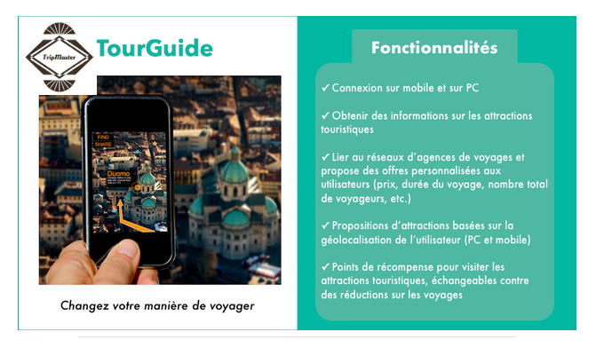</a><br>

 It is available as a web interface both on PC & mobile platforms for all touristic users.

 Key features
- Helps explore and discover attractions available near user's travel location;
- Provides reliable and up-to-date real-time information on the discounts for Travel, Hotel reservation, Touristic Attractions Ticket offers, etc.;
- Personalised serach information based on the user's favorite preferences related to touristic attractions and travel offers.

To meet the explosive growth on the touristic user's client base, architecture redesigned is being implemented in this project to optimize performance for high volume user demands.


## Prerequisites to run

- Java 1.8 JDK
- Gradle 7.3
- Docker

## Technological Spec Stacks:

Java, Gradle & Docker

## Architectural Spec:

TourGuide application is composed of 4 microservices:

-  **TourGuide**
-  **gps-ms (microservice)**
- **rewards-ms (microservice)**
- **tripDeals-ms (microservice)**

<a href="#">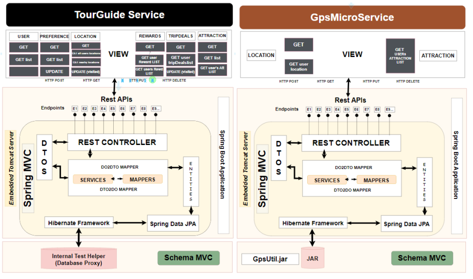</a><br>
<a href="#">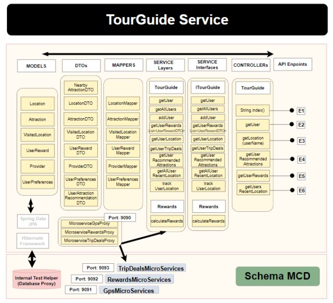</a><br>
<a href="#">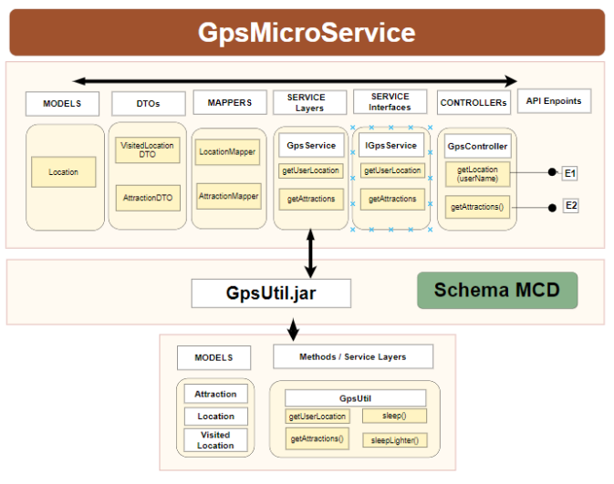</a><br>
<a href="#">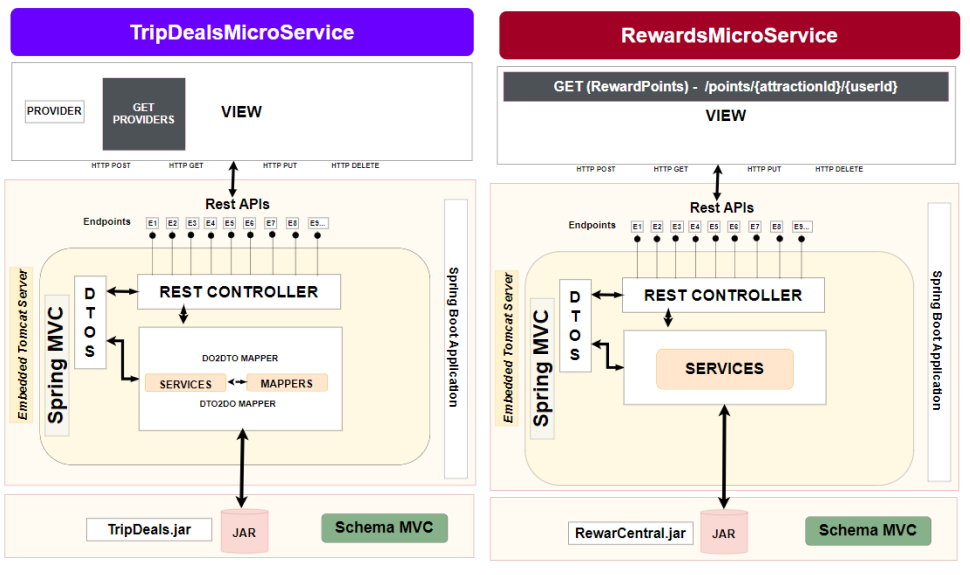</a><br>
<a href="#">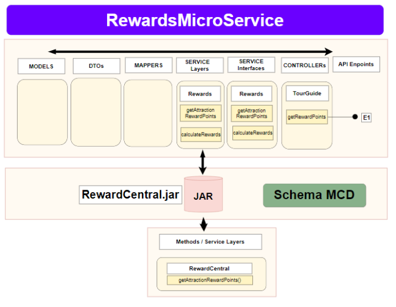</a><br>
<a href="#">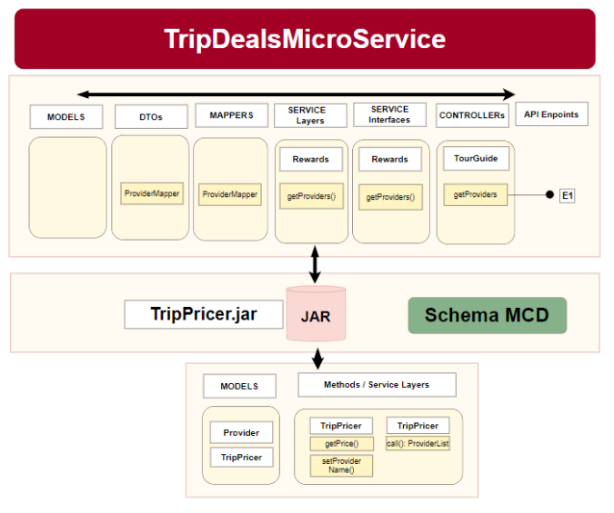</a><br>

 // TODO - documentation under progress

## Application Run configuration

Gradle 
```
gradle bootRun
```
## Docker deploiement

- **Dockerfile** 
 // TODO - documentation under progress

## Endpoints

 // TODO - documentation under progress


## Testing

Gradle, Junit (Unit & Integration Tests). <br/>
 

## Reporting

 - FinishLine. <br/>

 <a href="#">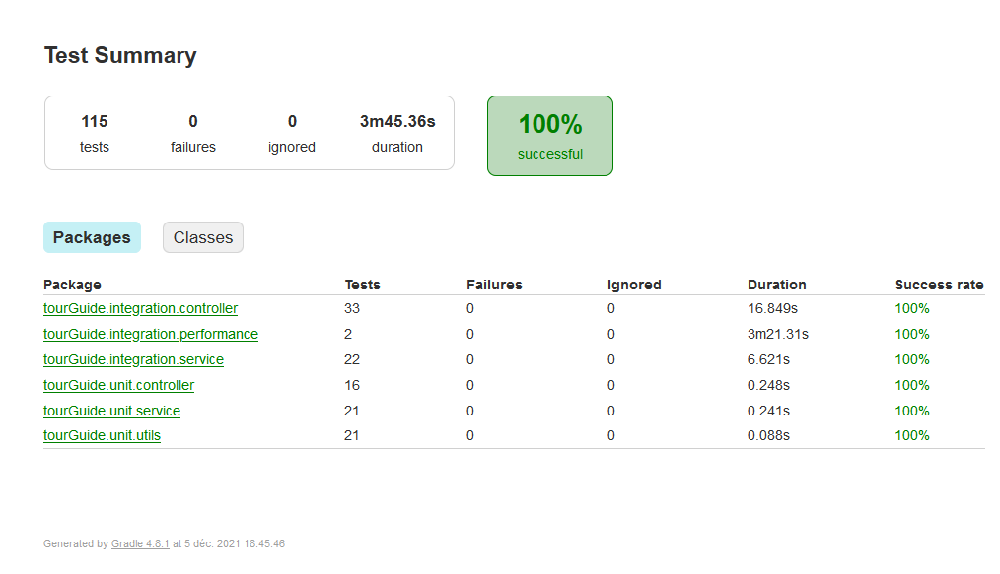</a><br>
 <a href="#">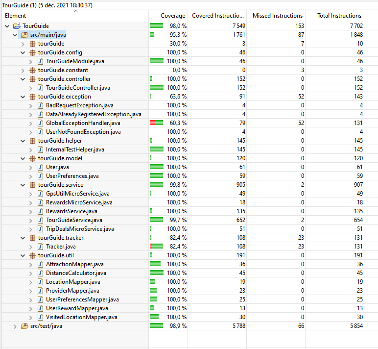</a><br>
 <a href="#">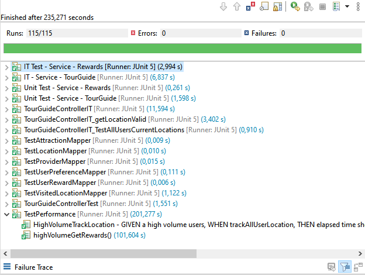</a><br>
 
 Gradle tests - StartLine. <br/>
 <a href="#">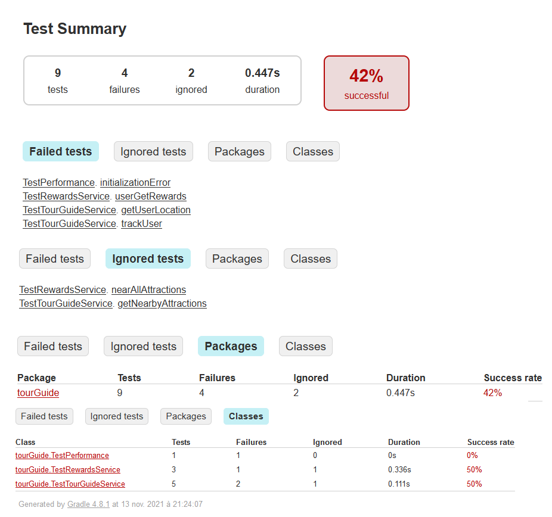</a><br>
 
 // TODO - documentation under progress

## Metrics
TestPerformanceon highVolume User Tracking & User Rewards Computations are performed & available.

<a href="#"></a><br>
<a href="#">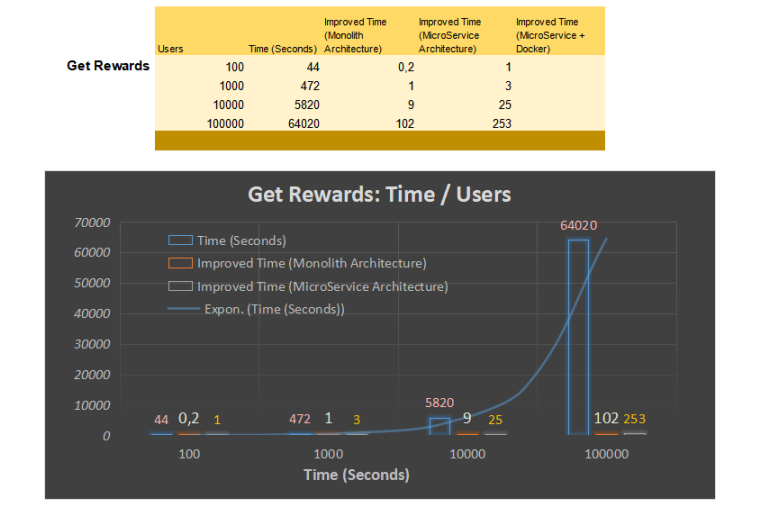</a><br>
<a href="#"></a><br>
<a href="#">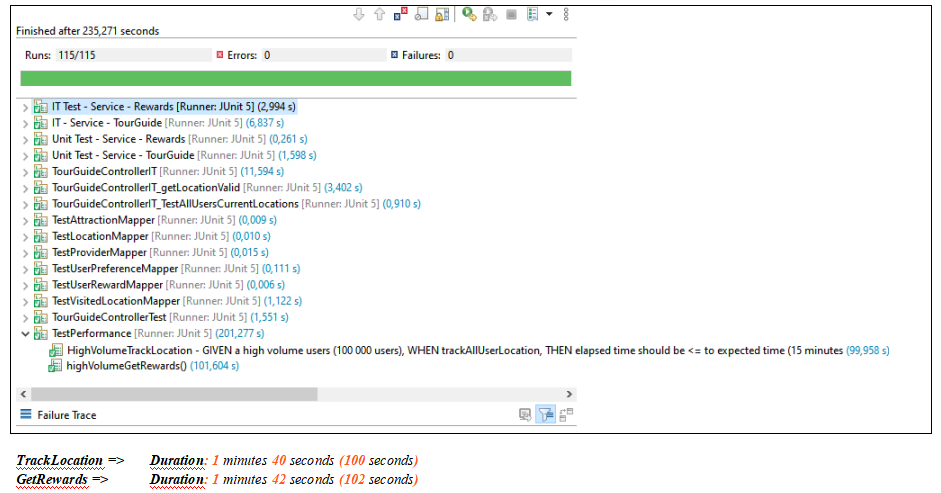</a><br>

 // TODO - documentation under progress

## Author

**@senthil**