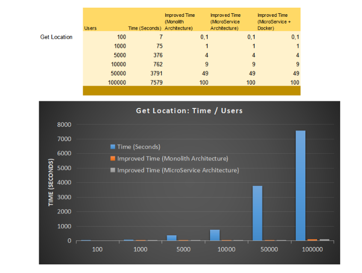

 ***  ***  *** 

<h1 align="center">TourGuide</h1>

TourGuide is a game changer Spring Boot web application with MSA (MicroService Architecure) technologies developed by TripMaster.
The strong highlight features of the application's Architecture is that it resonates through its rich functionality for its flexible scalability & high availability .
<br>

<a href="#"></a><br>

 It is available as a web interface both on PC & mobile platforms for all touristic users.

 Key features
- Helps explore and discover attractions available near user's travel location;
- Provides reliable and up-to-date real-time information on the discounts for Travel, Hotel reservation, Touristic Attractions Ticket offers, etc.;
- Personalised serach information based on the user's favorite preferences related to touristic attractions and travel offers.

To meet the explosive growth on the touristic user's client base, architecture redesigned is being implemented in this project to optimize performance for high volume user demands.


## Prerequisites to run

- Java 1.8 JDK
- Gradle 7.3
- Docker

## Technological Spec Stacks:

Java, Gradle & Docker

## Architectural Spec:

TourGuide application is composed of 4 microservices:

-  **TourGuide**
-  **gps-ms (microservice)**
- **rewards-ms (microservice)**
- **tripDeals-ms (microservice)**

<a href="#"></a><br>
<a href="#"></a><br>
<a href="#"></a><br>
<a href="#"></a><br>
<a href="#"></a><br>
<a href="#"></a><br>


## Application Run configuration

Gradle 
```
gradle bootRun or ./gradle bootRun
```
```
gradle bootWar or ./gradle bootWar or ./gradle bootJar
```

## Docker

Use the **Dockerfile** on the package root containing 4 services:
- `docker build . -f Dockerfile -t imageNameToBeCreated`
- `docker run -d -p HostPort:InternalPort --name dockerContainerNameToBeCreated -d DockerImageName`

To deploy all TourGuide microservices, use the **docker-compose.yml** on the package root containing all 4 services as configured together

- `docker-compose up -d`


## Testing

Gradle, Junit (Unit & Integration Tests). <br/>
 


## Reporting

 ### FinishLine. <br/>

 <a href="#"></a><br>
 <a href="#"></a><br>
 <a href="#"></a><br>
 
 ### Gradle tests - StartLine. <br/>
 <a href="#"></a><br>
 


# Metrics
TestPerformanceon highVolume User Tracking & User Rewards Computations are performed & available.

<a href="#"></a><br>
<a href="#"></a><br>
<a href="#"></a><br>
<a href="#"></a><br>

 ## API (Endpoints) documentation 

[POSTMAN - TOURGUIDE APIs](https://documenter.getpostman.com/view/16200863/UVR5sV8W){:target="_blank" rel="noopener"}<br>


### Authors
Mentee:  🡆   @Senthil<br>
Mentor:  🡆   Clément SEZETTRE

### versions
Version:  🡆 1.0

### License
@OpenClassrooms & @TourGuide


Reference Documentation
===
For further reference, consider the following sections:


* [Spring Web](https://docs.spring.io/spring-boot/docs/2.5.4/reference/htmlsingle/#boot-features-developing-web-applications)
* [STAN DOCUMENTATION WHITE PAPER](http://stan4j.com/papers/stan-whitepaper.pdf) 


Reference Guides
===
The following guides illustrate how to use some features concretely:

* [Building a RESTful Web Service with Spring Boot Actuator](https://spring.io/guides/gs/actuator-service/)
* [Securing a Web Application](https://spring.io/guides/gs/securing-web/)
* [Building a RESTful Web Service](https://spring.io/guides/gs/rest-service/)
* [Serving Web Content with Spring MVC](https://spring.io/guides/gs/serving-web-content/)
* [Building REST services with Spring](https://spring.io/guides/tutorials/bookmarks/)
* [STAN Structure Analysis for Java](http://stan4j.com/)